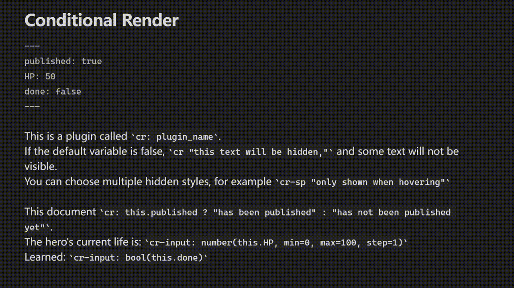

# Conditional Render

Conditional Render is a lightweight plugin that provides variable-based conditional rendering for Obsidian.

**English** | [简体中文](README.zh-CN.md)

---

## Highlights

- Use `cr "text"` to hide or show text with one command, supporting 9 hidden styles
- Supports reading and modifying note frontmatter variables and custom global variables
- Use `cr:` to render inline expressions
- Use `crif:` / `crelse:` to render conditional code blocks
- Use `cr-input` to edit variables with one command
- Supports custom plugin identifiers, such as `cr`, `cat`

## Installation

Still under testing. It has not been submitted to the Obsidian community plugin store yet. Please go to releases to install it first.

## Quick Example
Global Variables

```
default_var = false
plugin_name = Conditional Render
```

Frontmatter:

```yaml
---
published: true
HP: 88
done: false
---
```

In the note:

```md
This is a plugin called `cr: plugin_name`.
If the default variable is false, `cr "this text will be hidden,"` and some text will not be visible.
You can choose multiple hidden styles, for example `cr-sp "only shown when hovering"`

This document `cr: this.published ? "has been published" : "has not been published yet"`.
The hero's current life is: `cr-input: number(this.HP, min=0, max=100, step=1)`
Learned: `cr-input: bool(this.done)`
```



## Global Variables

Global variables are managed in the plugin settings.

Each variable includes:

- Name
- Type: `string`, `number`, `boolean`
- Value

Supported operations:

- Add, delete, rename, drag to sort
- Edit value, modify type
- Set as default variable
- JSON import / export

## Syntax

### Inline Expressions

Use `cr:` to calculate and output the result of an expression.

```md
`cr: plugin_name`
`cr: "This is a plugin called " + plugin_name`
`cr: this.score + 1`
`cr: this.score >= 60 ? "Pass" : "Fail"`
```

### Simple Conditional Inline Text

Use the default variable to control whether a short piece of text is shown.

```md
`cr "Text shown when the default variable is true, and shown with hidden style when false"`
```

### Conditional Code Blocks

````md
```cr
crif: this.published
This note has been published.
>supports **native** _styles_
crelse:
This note is still a draft.
I am using {{plugin_name}}, and I am still {{100 - this.score}} points away from a full score.
```
````

Explanation:

- Nested use is not supported
- Use {{variable name}} for variable replacement
- If the plugin identifier is modified, it also needs to be changed here, such as `catif:`, `catelse:`
- If `crelse:` is omitted and the condition is false, the content will be displayed according to the current hidden style.
- If `crif:` is omitted, the plugin will fall back to the default variable in settings.

## Hidden Styles

When the condition is false and there is no `crelse:`, hidden styles can be used to force a style for a single code block or a single inline content.

Code block examples:

````md
```cr-underline
crif: false
Hidden with underline style
```

```cr-sp
crif: false
Hidden with spoiler style
```
````

Inline examples:

```md
`cr-text "show as specified text"`
`cr-u "hidden with underline"`
`cr-sp "hidden as spoiler"`
```

Shorthand is also supported:

| Full form                     | Shorthand   |
| ----------------------------- | ----------- |
| `cr-none`                     | `cr-n`      |
| `cr-text`                     | `cr-t`      |
| `cr-text-grey`                | `cr-tg`     |
| `cr-underline`                | `cr-u`      |
| `cr-blank`                    | `cr-b`      |
| `cr-spoiler`                  | `cr-sp`     |
| `cr-spoiler-round`            | `cr-spr`    |
| `cr-spoiler-white`            | `cr-spw`    |
| `cr-spoiler-white-round`      | `cr-spwr`   |

## Interactive Input

Interactive input can directly edit:

- Plugin global variables
- `this.xxx` in the current note frontmatter

```md
`cr-input: bool(plugin_status)`
`cr-input: string(plugin_name)`
`cr-input: number(this.score)`
```

Supported types:

- `bool(...)`
- `string(...)`
- `number(...)`

Supported parameters:

- `placeholder`
- `debounce`
- `min`
- `max`
- `step`

Examples:

```md
`cr-input: string(this.nickname, placeholder="Please enter nickname")`
`cr-input: number(this.score, min=0, max=100, step=1)`
`cr-input: string(this.title, debounce=400)`
```

## Settings

Conditional Render provides the following settings:

- Plugin identifier
- Global default hidden style
- Custom prompt text for text hidden styles
- Global variables
- Default variable
- JSON import / export

After modifying the plugin identifier, all prefixes will change accordingly after restart. For example, if `cr` is changed to `cat`, then `crif:` will become `catif:`, and `cr-input:` will become `cat-input:`.

## Dataview Access

Global variables of the plugin can be accessed in DataviewJS.

```dataviewjs
const crPlugin = app.plugins.plugins["conditional-render"];

if (crPlugin) {
  const variables = crPlugin.settings.variables;
  const targetVar = variables.find(v => v.name === "plugin_status");

  if (targetVar) {
    dv.paragraph(`Read successfully: **${targetVar.value}**`);
  }
}
```

## Example Note

For the example note, see:

- [Example Note (English)](./example-notes/example-note.en.md)

## License

MIT
